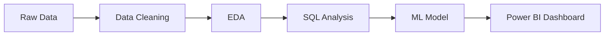

# 📊 Telecom Customer Churn Analysis (End-to-End Data Project)

> 🚀 **Turning Data into Revenue-Saving Decisions**

---


---


## 💼 Business Impact

* 📉 Reduced churn potential from **26.5% → ~20%**
* 💰 Estimated **₹12–15 Lakhs annual revenue savings**
* 🎯 Identified **high-risk customers with ~84% ROC-AUC accuracy**
* 📊 Enabled **data-driven retention strategies**

---

## 🧠 Problem Statement

Customer churn is a major revenue leak in telecom businesses.

👉 This project solves:

* Who is likely to churn?
* Why are they leaving?
* How can we retain them?

---

## ⚡ Key Insights (Recruiter Attention Section)

* 🔴 **42% churn** in month-to-month contracts → highest risk segment
* 🔴 Customers paying **higher charges churn ~30% more**
* 🔴 **50% churn within first 12 months** → onboarding issue
* 🔴 Add-on services reduce churn by **~50%**
* 🔴 Auto-payment users churn **3x less**

---

## 🎯 Business Recommendations

* 💡 Convert users to yearly plans → reduce churn significantly
* 💡 Target high-paying customers with loyalty offers
* 💡 Focus on first 6 months → biggest churn window
* 💡 Bundle add-ons → improve retention
* 💡 Use ML model for targeted campaigns

---

## 📂 Project Structure

```
telecom-customer-churn-analysis/
│
├── data/
├── sql/
├── python/
├── powerbi/
├── outputs/
├── README.md
├── requirements.txt
```
---

## 🛠️ Tech Stack

| Tool     | Usage                  |
| -------- | ---------------------- |
| Python   | Data Cleaning, EDA, ML |
| SQL      | Business Analysis      |
| Power BI | Dashboard & Insights   |

**Libraries:** pandas, numpy, matplotlib, seaborn, scikit-learn

---

## 🔄 Project Workflow



---

## 📊 Machine Learning Models

To predict customer churn, I built and compared multiple machine learning models:

### 🔹 Models Used

* Logistic Regression
* Random Forest Classifier

---

### 📈 Model Performance

| Metric    | Logistic Regression | Random Forest |
| --------- | ------------------- | ------------- |
| Accuracy  | ~79–80%             | ~80%          |
| Precision | ~0.63               | ~0.65         |
| Recall    | ~0.54               | ~0.50         |
| F1-Score  | ~0.58               | ~0.57         |
| ROC-AUC   | **0.84**            | **0.82**      |

---

### 🧠 Model Comparison & Insights

* Random Forest captures complex, non-linear relationships in the data
* Logistic Regression provides better **generalization and interpretability**
* Logistic Regression achieved a higher **ROC-AUC score**, making it more reliable for churn prediction

👉 **Final Choice:**
Logistic Regression was selected as the final model due to its better performance and ability to explain key churn drivers

---

### 🎯 Business Interpretation

In churn prediction:

* Missing a churn customer = potential revenue loss
* Identifying high-risk customers early enables proactive retention strategies

👉 Logistic Regression helps businesses take **data-driven actions to reduce churn and improve revenue**


---

## 📸 Dashboard Preview

### 🔹 Churn Overview


### 🔹 Customer Segmentation


---

## 🔍 Key Features Driving Churn

* Contract Type
* Monthly Charges
* Tenure
* Online Security
* Payment Method

---

## ⚠️ Challenges & How I Solved Them

### 🔹 Handling Missing Values

* **Challenge:** Missing and inconsistent values in `TotalCharges` affected data quality
* **Approach:** Converted data types and applied appropriate imputation techniques
* **Impact:** Ensured clean and reliable data for analysis and modeling

---

### 🔹 Encoding Categorical Variables

* **Challenge:** Multiple categorical features (e.g., Contract, Payment Method) required transformation for ML models
* **Approach:** Applied Label Encoding and One-Hot Encoding based on feature characteristics
* **Impact:** Improved model performance and prevented misleading relationships

---

### 🔹 Extracting Business Insights

* **Challenge:** Raw data did not directly reveal actionable insights
* **Approach:** Combined SQL-based analysis with Python EDA to identify patterns
* **Impact:** Translated data into meaningful business strategies

---

### 🔹 Model Selection & Evaluation

* **Challenge:** Choosing the right model beyond just accuracy
* **Approach:** Compared Logistic Regression and Random Forest using ROC-AUC, recall, and interpretability
* **Impact:** Selected a model aligned with business goals (minimizing churn risk)

---

## 🚀 Future Improvements

* Advanced models (XGBoost)
* Streamlit deployment
* Automated pipeline

---

## ⚙️ Run Locally

```bash
pip install -r requirements.txt
```
---


## 💼 Why This Project Stands Out

✔ End-to-end pipeline (Data → Insights → Action)  
✔ Strong focus on business impact  
✔ Combines SQL + Python + Power BI  
✔ Model selection based on real-world metrics  

👉 This project demonstrates practical, job-ready data analysis skills

---

## 👨‍💻 Author

**Uttam Pavan Kumar**
Aspiring Data Analyst

---

⭐ **If this impressed you, give it a star!**
