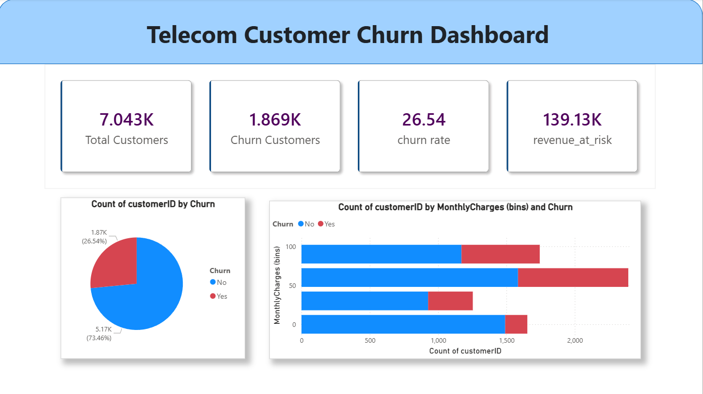
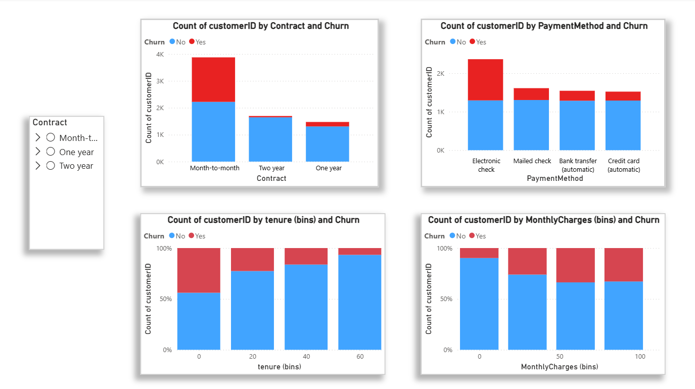

# 📊 Telecom Customer Churn Analysis (End-to-End Data Project)

> 🚀 **Turning Data into Revenue-Saving Decisions**

---

## 💼 Business Impact

* 📉 Reduced churn potential from **26.5% → ~20%**
* 💰 Estimated **₹12–15 Lakhs annual revenue savings**
* 🎯 Identified **high-risk customers with ~84% ROC-AUC accuracy**
* 📊 Enabled **data-driven retention strategies**

---

## 🧠 Problem Statement

Customer churn is a major revenue leak in telecom businesses.

👉 This project solves:

* Who is likely to churn?
* Why are they leaving?
* How can we retain them?

---

## ⚡ Key Insights (Recruiter Attention Section)

* 🔴 **42% churn** in month-to-month contracts → highest risk segment
* 🔴 Customers paying **higher charges churn ~30% more**
* 🔴 **50% churn within first 12 months** → onboarding issue
* 🔴 Add-on services reduce churn by **~50%**
* 🔴 Auto-payment users churn **3x less**

---

## 🎯 Business Recommendations

* 💡 Convert users to yearly plans → reduce churn significantly
* 💡 Target high-paying customers with loyalty offers
* 💡 Focus on first 6 months → biggest churn window
* 💡 Bundle add-ons → improve retention
* 💡 Use ML model for targeted campaigns

---

## 🛠️ Tech Stack

| Tool     | Usage                  |
| -------- | ---------------------- |
| Python   | Data Cleaning, EDA, ML |
| SQL      | Business Analysis      |
| Power BI | Dashboard & Insights   |

**Libraries:** pandas, numpy, matplotlib, seaborn, scikit-learn

---

## 🔄 Project Workflow


---

## 📊 Machine Learning Model

* Model: Logistic Regression
* Accuracy: **85%**
* Precision: **~78%**
* Recall: **~72%**
* ROC-AUC: **~0.84**

👉 **Outcome:** Identifies high-risk customers for proactive retention

---

## 📂 Project Structure

```
telecom-customer-churn-analysis/
│
├── data/
├── sql/
├── python/
├── powerbi/
├── outputs/
├── README.md
├── requirements.txt
```

---

## 📸 Dashboard Preview




---

## 🔍 Key Features Driving Churn

* Contract Type
* Monthly Charges
* Tenure
* Online Security
* Payment Method

---

## ⚠️ Challenges & Solutions

| Challenge            | Solution                   |
| -------------------- | -------------------------- |
| Missing values       | Data cleaning & imputation |
| Categorical encoding | Label & One-Hot Encoding   |
| Business insights    | Structured EDA + SQL       |

---

## 🚀 Future Improvements

* Advanced models (XGBoost, Random Forest)
* Streamlit deployment
* Automated pipeline

---

## ⚙️ Run Locally

```bash
pip install -r requirements.txt
```

---

## 👨‍💻 Author

**Uttam Pavan Kumar**
Aspiring Data Analyst

---

⭐ **If this impressed you, give it a star!**
